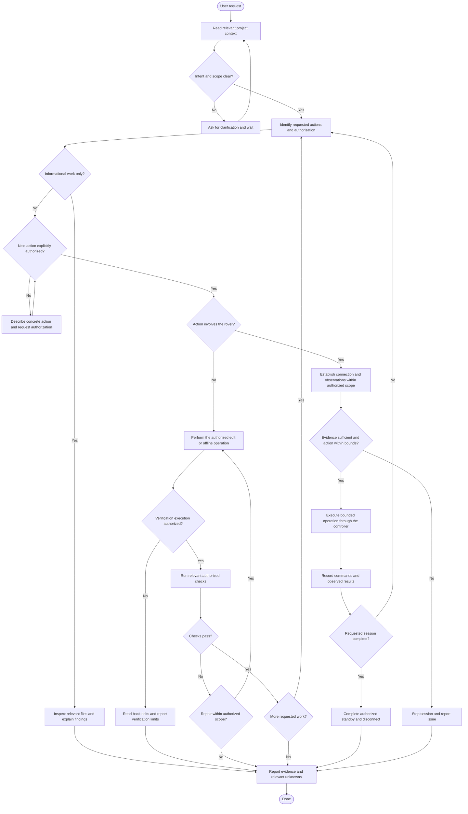
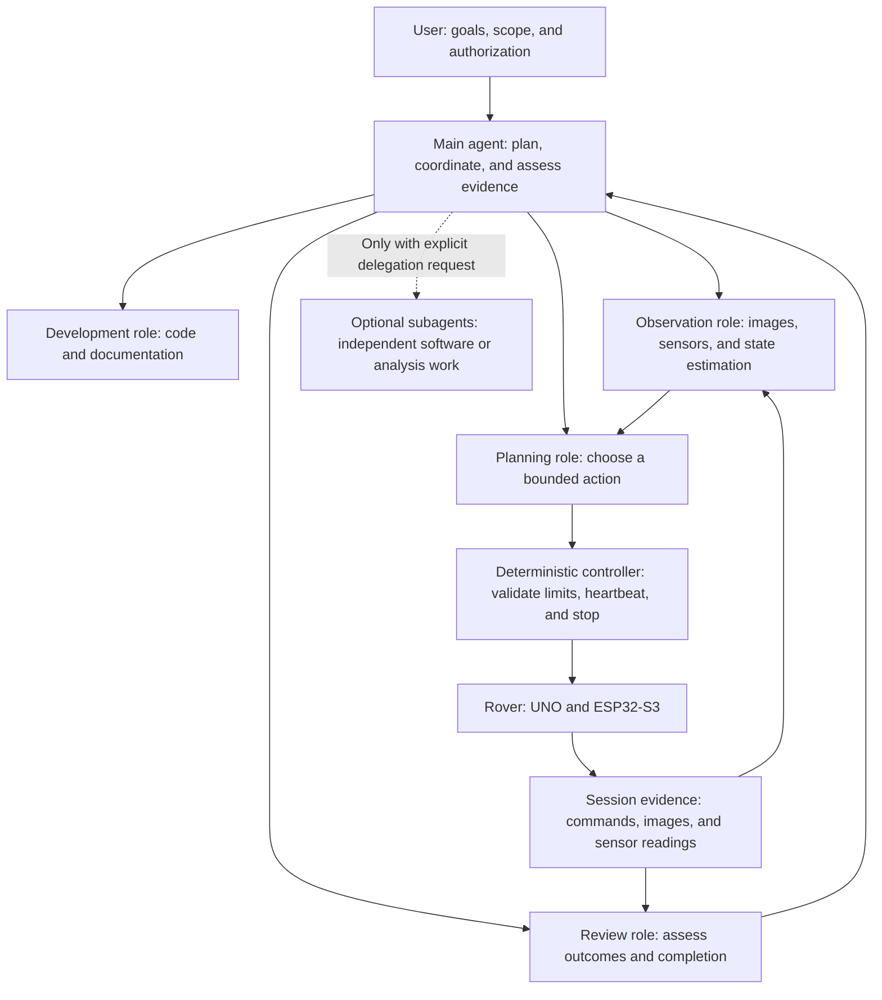
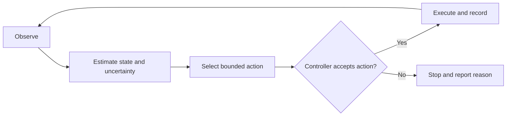

# Agentic workflow

This document records the proposed development and rover-operation workflow.
The runtime observation/planning loop and autonomous exploration are proposals,
not implemented capabilities. See [README](README.md) for current capabilities
and [AGENTS](AGENTS.md) for agent instructions and authorization rules.

## Decision process

Editing, execution, testing, installation, simulation, and hardware operations
must be covered by explicit authorization. Authorization may cover several
actions or an entire defined session together; it need not be requested again
for each step within that scope. Observation, recording, and session stop actions
must also be included in the authorized hardware session.

## Agent hierarchy

These roles describe responsibilities and can run within one main agent.
Subagents are optional and require an explicit user request. One controller
owns the rover TCP connection; concurrent agents do not independently drive it.

## Proposed runtime loop

The AI selects actions within an authorized session. Deterministic code enforces
command bounds and handles connection loss and stopping. Command acknowledgments
are recorded separately from observations of physical results.

## Proposed development sequence

1. Shared rover interface for commands, sensors, captures, and session logging.
2. Reliable manual sessions with coordinated observations and timing metadata.
3. Reconstruction from saved captures.
4. Bounded supervised exploration trials.
5. Autonomous exploration after state estimation and physical stopping behavior
   have been verified for the intended operating conditions.

Each stage requires its own defined implementation and verification scope.
