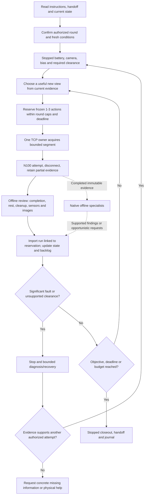
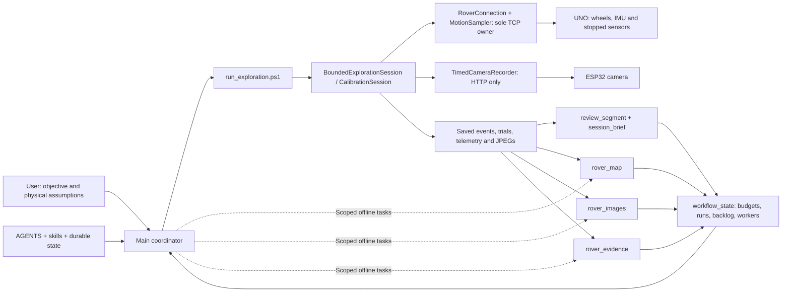

# Codex-native rover workflow

The main coordinator collects useful new views in an explicitly scoped exploration
round. It chooses the route, owns the rover controller and records decisions.
Offline workers analyze completed evidence concurrently. Their pending work does
not block a supported segment; significant findings can change its next decision.
The rover stops between pulses while the coordinator continues planning.

## Native components and persistent state

| Component | Maintained location | Responsibility / verified status |
|---|---|---|
| Project instructions | AGENTS.md | Retrieval, authorization, evidence and controller ownership |
| Coordination skill | .agents/skills/rover-coordinator/SKILL.md | Reusable main-agent workflow; visible in this chat's skill catalog |
| Experiment skill | .agents/skills/rover-experiment/SKILL.md | Existing experiment preparation and assessment routing |
| Native specialist profiles | .codex/agents/rover_map.toml, rover_images.toml, rover_evidence.toml | Required TOML fields parsed; actual client discovery/spawn not yet verified |
| Approval rules | .codex/rules/*.rules | Existing command approval policy; does not authorize a task or prove physical safety |
| Project task state | rover/state/task-state.json and selected round-state file | Explicit scope proposals, reservations, evidence cutoff, workers, backlog and history |
| State shortcut | src/tools/workflow_state.ps1 | Atomic locked offline updates, idempotent imports and conservative bookkeeping |
| Immediate review | src/tools/review_segment.ps1 | Saved completion/rest/cleanup/events/battery predicates |
| Session summary | src/tools/session_brief.ps1 | Saved trial/sensor/timing inventory and HTML report |
| Native generated memory | Codex-managed memory controls/store | Supplemental prior-chat context; host setting not inspected or changed |
| Lifecycle hooks | None | User requested removal; no hook file/handler remains |
| MCP/plugins/automations | Existing app tools only | No new connector, plugin, scheduler or autonomous hardware job installed |

Custom agents are native standalone TOML definitions, not separate role Markdown
prompts. Model, reasoning and permission settings inherit from the parent; offline
boundaries are explicit instructions, not an independent tool/network ACL. Current
collaboration tools do not expose a native-profile selection parameter. Do not claim
that a generic worker spawned here used a native profile. The next compatible client
must actually load/select the profile before reporting that integration verified.
[Official custom-agent documentation](https://learn.chatgpt.com/docs/agent-configuration/subagents).

Skills belong under .agents/skills. Their availability is different from custom-agent
loading. [Official skill documentation](https://learn.chatgpt.com/docs/build-skills).

Codex-generated memory is managed through product controls, not by hand-editing its
internal store. It is asynchronous and cannot replace current mission accounting,
explicit authorization or fresh sensors. Read AGENTS, current handoff and selected
project state after resume/compaction. Durable project state is our domain-specific
mission ledger; it is not a replacement for Codex's internal chat/task state.
[Official memory documentation](https://learn.chatgpt.com/docs/customization/memories).

Hooks were evaluated and removed at the user's request. They are not secretly used
for state restoration or automatic continuation. Adding them later would require a
specific use case and Codex's hook review/trust. [Official hook documentation](https://learn.chatgpt.com/docs/hooks).

## Decision loop



The exploration runner enforces PWM60/T200 ms and 1-3 forward/left/right actions.
There is no reverse, automatic power escalation or autonomous route planner.
State reservations check bookkeeping caps/deadline, but the live launcher does not
read or enforce the ledger. The coordinator must reserve and match the exact plan
before dispatch. A successful reservation never grants live permission.

Count full frozen reservations conservatively before dispatch. Link each resulting
run to its reservation to avoid double charging. Unlinked imported runs consume
additional observed budget. Unknown/malformed/failure accounting blocks further
reservations. Do not discard a reservation because a transport result is uncertain.
Send events are logged after socket send, so logged N4 counts alone are lower bounds;
a partially sent unlogged command cannot be reconstructed from a manifest.

## Hierarchy and tool connections



With authorized delegation, reuse workers; do not spawn them per image. The main
alone writes the shared state ledger and chooses motion. Workers get completed-run
cutoff, focused question, authorized execution/output scope and unique output path.
They return severity, claim, exact evidence, uncertainty and any requested view with
priority/expiry. The coordinator records requests as pending, collected, deferred or
cancelled. A map suggestion never establishes a traversable corridor or swept clearance.

- rover_map: landmarks, observable view links, revisits and unknown directions.
- rover_images: static/dynamic features, overlap/parallax and supported diagnostics.
- rover_evidence: faults, timing, rest/cleanup support and contradictory claims.

The map remains a view/landmark graph until localization is supported. Intrinsics,
metric pose and Euclidean reconstruction remain open. Collect translated overlapping
views when they fit the route; do not halt useful local collection for reconstruction.

## Round preparation and productive cycle

Define objective, live action scope, prepared-area/body/path/swept-turn assumptions,
max attempted pulses and segments, deadline, retry allowance and completion evidence.
Archive the authorization reference separately from the proposal ledger. Current
state is not_started with zero/zero caps: no new live round has been selected.

At round start re-establish Wi-Fi/CAM, closed other controllers, fresh battery/view/
bias support and required clearance. Old images, voltage, echo, servo commands and
movement history do not establish current conditions. Use a single first action
when uncertain; freeze up to three only when the whole segment fits known clearance.

Each segment already records a 12-batch baseline and fresh bias per trial. Keep those
checks; avoid duplicate standalone baselines/preflights before successful segments.
After disconnect inspect actual review predicates, sensor trends and images. Then
update state, dispatch immutable paths and choose the next supported segment without
waiting for heavy background fitting. Queue data when all workers are busy.

Give concise progress updates at least once a minute during work. Reserve time for
stopped closeout. Stop on objective/cap/deadline or unresolved material fault; don't
leave rover access unused while waiting for noncritical analysis.

## Stop and recovery decisions

| Evidence | Coordinator decision |
|---|---|
| N1 <7.0 V, invalid or missing battery | End acquisition, attempt stop/close; resolve battery evidence |
| IMU/camera/connection fault, missing cleanup or unsupported rest | Retain partial run and diagnose disconnected; no blind replay |
| >90% valid echo shortening at unchanged heading | Stop/reassess; exactly90% allowed, turn resets reference |
| Echo-only refusal with clean cleanup/no other fault | Up to three separately logged retries within authorized allowance, fresh evidence and specific recovery reason |
| Zero/invalid echo or very short absolute distance | Unknown/risky evidence; reassess required body/path/stopping clearance |
| Worker computation pending or reconstruction unsupported | Continue supported exploration; retain the uncertainty |
| Worker asks for a view | Backlog it and collect when route fits unless urgent supported evidence changes movement |

Never replay a whole failed segment that may already have moved. Inspect N4 sends,
reservation and trials; freeze only the intended next actions. A turn needs swept
clearance, not just a permissive echo ratio. No threshold relaxation/power escalation
for favorable results. Persistent unsupported evidence needs physical help.

Echo approximation: echo_us*0.0001715 m at343 m/s round-trip speed. Drop percentage:
100*(previous-current)/previous, only for positive echoes/comparable direction.
Historical stationary9.1/13.4 ms clusters changed roughly31-32% without demonstrated
approach. Final3518 us converts to0.603 m to a reflecting target, not full clearance.
Floor ADC has no validated cliff gate; upward camera sees little floor.

## Offline shortcuts and classroom demonstration

Current checkpoint:

```powershell
pwsh -NoProfile -File ./src/tools/workflow_state.ps1 -State rover/state/task-state.json -Action status
```

For a newly scoped round, create a NEW state file with the selected values, then
reserve each segment before the separate authorized live launcher:

```powershell
pwsh -NoProfile -File ./src/tools/workflow_state.ps1 -State data/<session>/analysis/<new-round>/state.json -Action create -Session data/<session> -Objective '<objective>' -MaxPulses <cap> -MaxSegments <cap> -Deadline '<ISO time with offset>' -MaxEchoRetries <0-3>
pwsh -NoProfile -File ./src/tools/workflow_state.ps1 -State <state> -Action reserve -Id segment-01 -Actions '<frozen-actions>'
pwsh -NoProfile -File ./src/tools/review_segment.ps1 -Session data/<session> -Run <run> -Output data/<session>/analysis/<new-output>-review
pwsh -NoProfile -File ./src/tools/workflow_state.ps1 -State <state> -Action import-run -Run <run> -ReservationId segment-01
```

State updates lock and atomically replace the JSON. Same unchanged imports/reservations
are idempotent; changed evidence/association or ambiguous accounting requires review.
Track workers and requested views using worker/request/update-request actions. No state
command spawns agents, contacts hardware, sets live_authorized true or overrides scope.

Saved class report:

```powershell
pwsh -NoProfile -File ./src/tools/session_brief.ps1 -Session data/20261009085621235 -LastRun 20261009094727199 -Output data/20261009085621235/analysis/<new-output>-brief
```

Use new outputs; raw logs/captures cannot be overwritten. Show the vector workflow PDF,
saved sensor/images, explicit decision card and native definitions. Demonstrate how
new evidence changes a decision and how a pending reconstruction request enters backlog.
Use retained historical refusals offline; no physical hazard/fault injection in class.
Success is useful observations and explainable bounded decisions, not a metric room model.

No new package/connector is necessary. Existing OpenCV/NumPy and standard-library state
support the immediate workflow. External SfM/matchers remain future offline evaluations.
README owns current command facts, procedure owns gates, results owns measured findings,
AGENTS owns working constraints and handoff owns current resume state. Preserve historical
evidence in journal, and preserve raw data, vendor files, backups and firmware artifacts.
